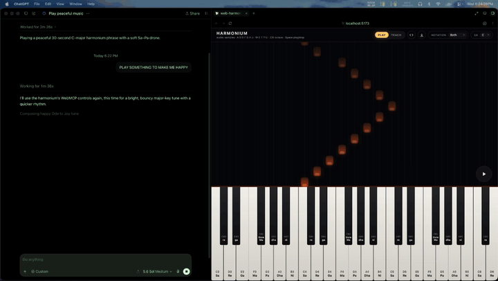
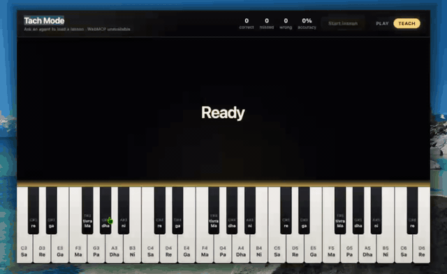

# web-harmonium

A browser Indian harmonium. Dark UI, 39 playable reed keys (23 white, 16 black) covering C3–D6 (MIDI 48–86), Sargam labels over a movable Sa, JSON score playback, and in-page WebMCP tools for agents.

One audio engine (`playNote(key)` / `stopNote(key)`) drives everything: mouse, computer keyboard, JSON score clock, and WebMCP. Keys light up exactly when they sound.

## Demo

** agent plays music:



**Play by hand** — mouse or computer keyboard, keys light as they sound:



## Run it

```bash
npm install
npm run dev
```

Open the printed URL (Vite defaults to `http://localhost:5173`), then **tap “Tap to start”** — Chrome blocks audio until a user gesture. On that tap the app calls `Tone.start()` / `AudioContext.resume()`, loads harmonium reed samples, and the instrument is playable.

Production build:

```bash
npm run build
npm run preview
```

## Playing

**Mouse/touch** — pointer down/up on any key.

**Computer keyboard** — a slice of the keyboard around C4 (key 12):

| Computer keys | Notes |
|---|---|
| A S D F G H J K L | white keys from the current octave base |
| W E T Y U | black keys (C#, D#, F#, G#, A#) |
| Z or [ | octave down |
| X or ] | octave up |
| Space | play / stop the loaded score (ignored while typing in text fields) |

Auto-repeat is ignored, and typing in the JSON textarea never plays notes.

**Sargam / movable Sa** — every key shows a Western name and a Sargam name relative to Sa (default Sa = C). On the **keyboard**, komal swaras display as lowercase (`re`, `ga`, `dha`, `ni`); natural swaras stay capitalized (`Re`, `Ga`, `Dha`, `Ni`). Canonical names for WebMCP and score JSON are unchanged (e.g. `komal Re`, `Re`). Changing Sa relabels only — frequencies never move (key 12 is always C4).

| Key (Sa = C) | Western | Keyboard label | WebMCP / score name |
|---|---|---|---|
| C | C | Sa | Sa |
| C# | C# | re | komal Re |
| D | D | Re | Re |
| D# | D# | ga | komal Ga |
| E | E | Ga | Ga |
| F | F | Ma | Ma |
| F# | F# | tivra Ma | tivra Ma |
| G | G | Pa | Pa |
| G# | G# | dha | komal Dha |
| A | A | Dha | Dha |
| A# | A# | ni | komal Ni |
| B | B | Ni | Ni |

## JSON score

**Edit JSON** (top bar) opens a simplified standalone editor tab: it starts with the current score, has a **Load demo** button (a short Sa–Re–Ga–Ma–Pa–Dha–Ni–Sa' phrase), and **Apply to harmonium** posts the edited JSON back to the main page, which validates it before loading. **Export JSON** downloads the current score as `harmonium-score.json`. The round ▶ / ❚❚ button plays or stops the loaded score.

Shape:

```json
{
  "sa": "C",
  "events": [
    { "t": 0.0, "key": 12, "note": "Sa", "dur": 0.5 },
    { "t": 0.5, "key": 14, "note": "Re", "dur": 0.5 }
  ]
}
```

- `t` — start time in seconds from playback start
- `key` — 0–38, the **source of truth for pitch**; if `note` disagrees, `key` wins and nothing crashes
- `note` — Sargam label (advisory)
- `dur` — duration in seconds; overlapping events are chords
- `sa` — updates the page’s Sa for labels before playing

The playback clock is the Web Audio clock (`Tone.Transport` scheduling), so keys light in sync with sound, not `setTimeout` drift.

## WebMCP tools (in-page, for agents)

This is a normal website — no server, no service worker. If the browser exposes the WebMCP page API (`document.modelContext.registerTool`, with `navigator.modelContext` as deprecated fallback), the page registers five tools that drive the **same visible keyboard**:

| Tool | Input | Returns |
|---|---|---|
| `play_note` | `{ key?: 0-38, note?: Sargam, dur?: seconds }` (key or note required) | `{ ok, tool, key, note, western, dur, sa }` or `{ ok: false, tool, error }`. Auto-releases after `dur` (default 2 s). |
| `play_score` | `{ sa?, events: [{ t, key, note?, dur }] }` (events ≥ 1) | `{ ok, tool, events, durationSeconds, sa }` or error shape. Honors the abort signal. |
| `set_sa` | `{ sa: "C"…"B" }` (12 Western names) | `{ ok, tool, sa, relabeled, retuned: false }`. Relabels only; never retunes. |
| `stop` | `{}` | `{ ok, tool, stopped: true }`. Stops all reeds and score playback. |
| `get_state` | `{}` | `{ ok, tool, sa, audioUnlocked, audioSource, activeKeys, scorePlaying }` (`readOnlyHint`). |

**Audio lock:** browsers require a user gesture for sound. If audio is locked, `play_note` and `play_score` return `{ ok: false, error }` asking the human to tap “Tap to start” first — WebMCP `execute` is not a user gesture. Every tool returns `{ ok, tool, ... }`; errors carry an `error` message.

**Enabling WebMCP for local testing:** Chrome needs `chrome://flags/#enable-webmcp-testing` enabled (then relaunch), or use a browser/agent with WebMCP support. Without it, the page shows “WebMCP unavailable” and the human instrument still works fully.

## Sound

- Preferred: `Tone.Sampler` with real harmonium reed recordings, chromatic anchors C3–D5 in `public/samples/harmonium/`; the sampler retunes the nearest anchor for the rest of the C3–D6 range. The upstream pack has no recordings above D5 and none for F#4, so 13 keys (F#4, D#5–D6) always sound retuned — an asset limit, not a bug.
- Fallback: if samples fail to load, a sustained reed-like `Tone.PolySynth` (detuned saw stack through a lowpass — not a percussive piano ping). The app always makes sound.

### Sample attribution

Harmonium samples from the [tonejs-instruments](https://github.com/Makefully-Studios/tonejs-instruments/tree/main/samples/harmonium) sample library by Makefully Studios, licensed **CC-BY 3.0**. See `public/samples/harmonium/README.md`. The app code itself is MIT (see `LICENSE`); sample licensing is separate.

## Stack

Vite + React + TypeScript + Tone.js. No secrets, no backend, no service workers.

## Verify

```bash
npm run typecheck   # tsc --noEmit
npm test            # pitch + score unit tests (node:test via tsx)
npm run check       # 39/23/16 key layout assertions
npm run build       # typecheck + production bundle
```
